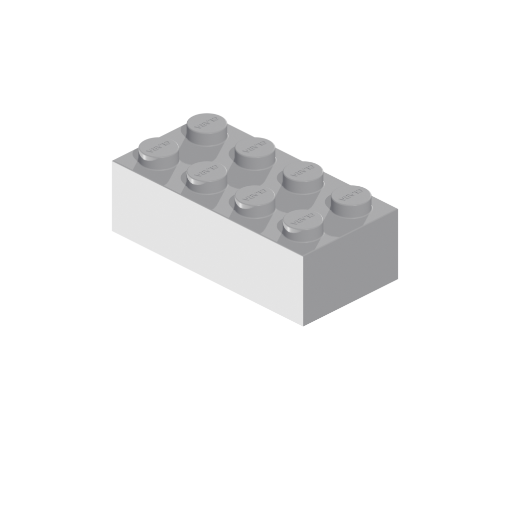
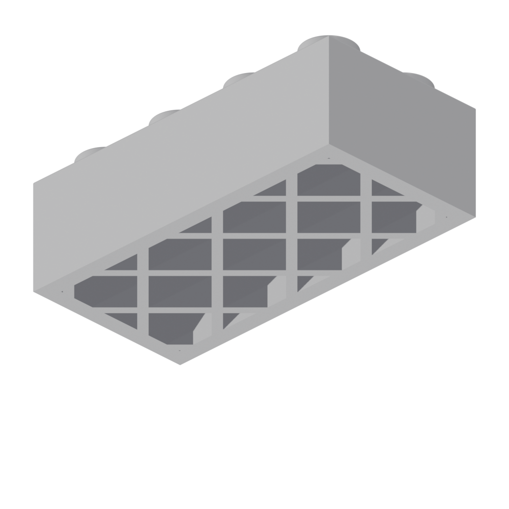
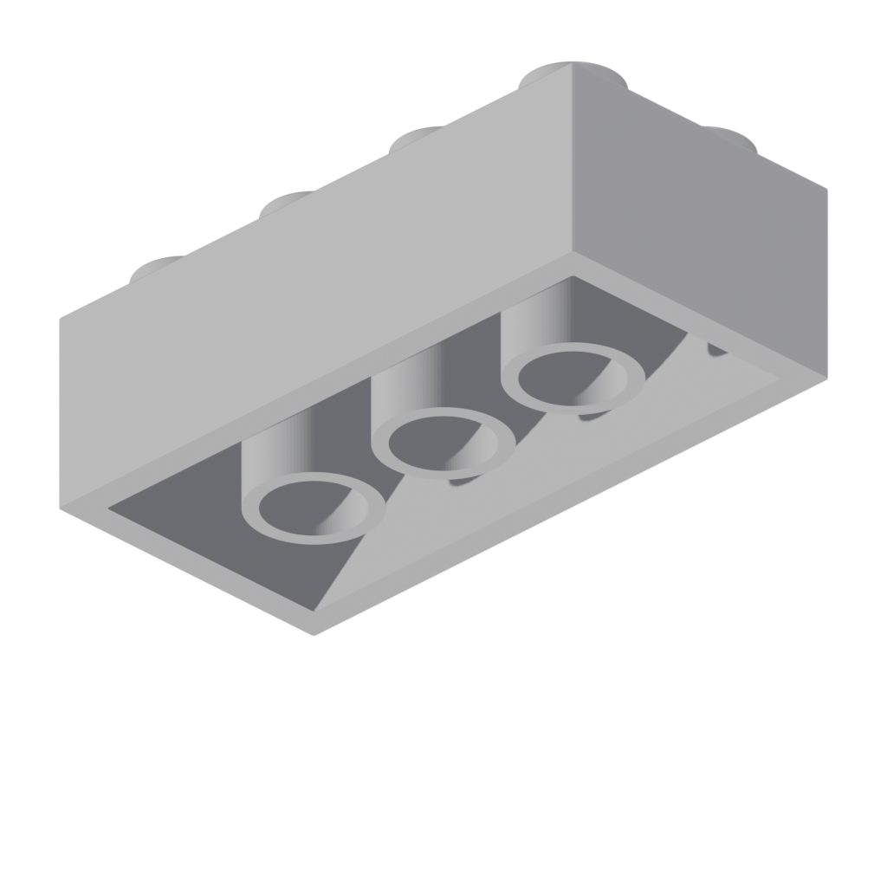
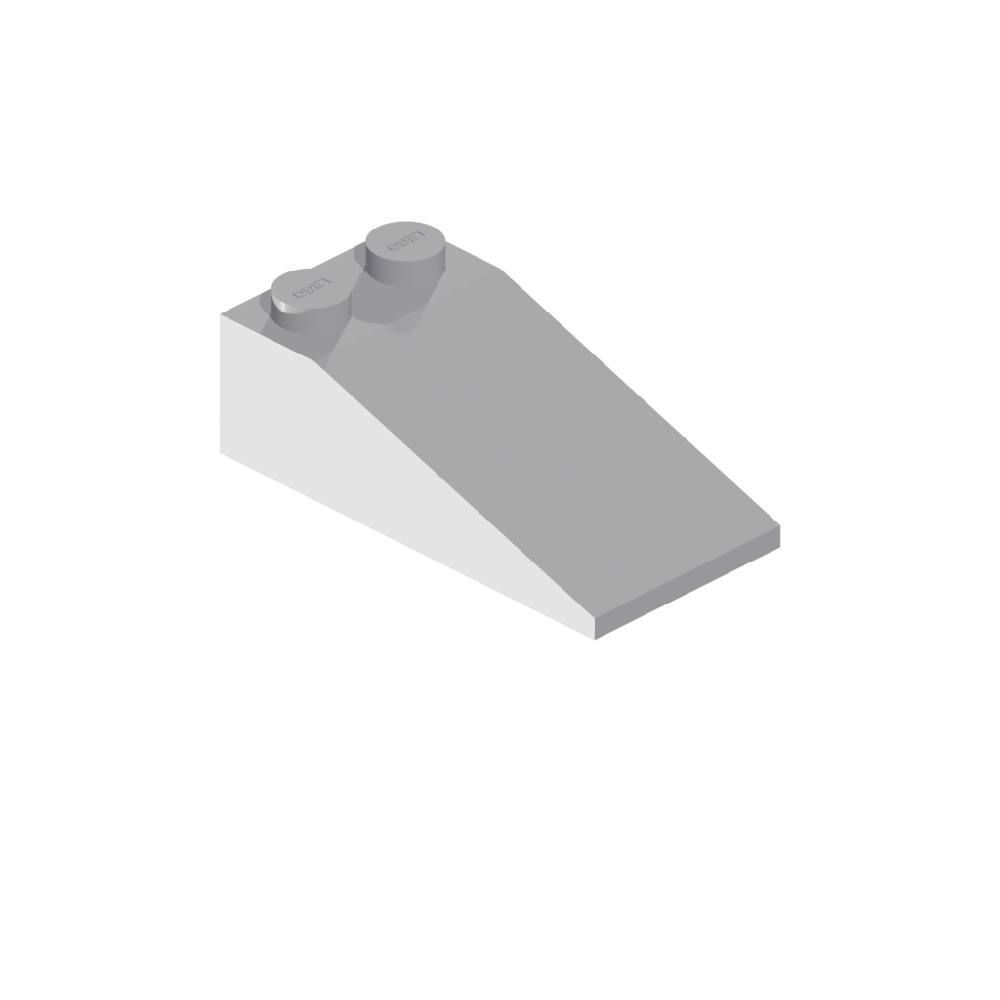
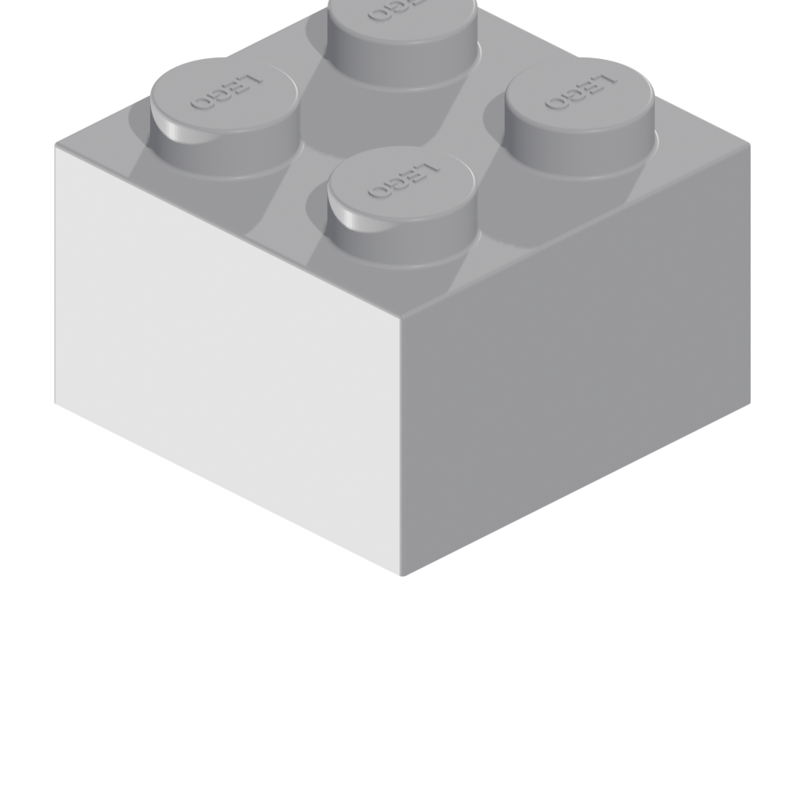

# build123d Live Blender Preview

Parametric brick modeling with [build123d](https://github.com/gumyr/build123d) and real-time Blender viewport preview. Edit parameters in Blender's sidebar panel — the mesh updates live.

Two brick systems with different clutch mechanisms: **Clara** (diagonal lattice) and **LEGO** (cylindrical tubes).

<p align="center">
  
  
  
</p>

<p align="center">
  <em>Left: Clara 2x4 with tapered walls. Center: Standard LEGO 2x4. Right: Clara slope brick.</em>
</p>

## How It Works

```
run.sh <model.py>
  └── Launches Blender with blender_watcher.py
       ├── Registers a sidebar panel with sliders for all parameters
       ├── Spawns a persistent build_worker.py subprocess (keeps build123d imported)
       └── On slider change or source file edit:
            1. Sends params as JSON to the worker
            2. Worker calls build123d to generate geometry
            3. Exports STL, Blender reimports via clear_geometry() + from_pydata()
            4. Materials, transforms preserved — mesh updates in-place
```

Rebuild time: ~0.9s steady-state (vs ~2.5s cold start) thanks to the persistent worker.

## Gallery

<p align="center">
  
  
</p>

<p align="center">
  <em>Left: Clara lattice clutch (wall-to-wall crisscross struts). Right: LEGO tube clutch (anti-stud cylinders).</em>
</p>

<p align="center">
  
  
</p>

<p align="center">
  <em>Left: LEGO 2x4 slope. Right: LEGO 2x2 plate (1/3 height).</em>
</p>

## Quick Start

### Prerequisites

- **Blender** 4.1+ (tested on 5.0)
- **Python** 3.10–3.13
- **uv** ([install](https://astral.sh/uv/install))

### Setup

```bash
git clone --recurse-submodules <repo-url>
cd build123d_tests

# Launch with Clara brick (default)
./run.sh

# Launch with LEGO brick
./run.sh models/bricks/lego/lego.py
```

Blender opens with a **build123d** sidebar panel (press `N` if hidden). Adjust sliders to explore parameter space. The mesh rebuilds automatically.

### Headless Rendering

```bash
# Render 14-angle diagnostic views
./render.sh models/bricks/clara/clara.py

# Output: renders/<model>/iso_fr.png, top.png, bottom.png, etc.
```

## Features

### Two Brick Systems

| System | Clutch | Description |
|--------|--------|-------------|
| **Clara** | Diagonal lattice | ±45° crisscross struts. 3D-print friendly (no overhangs). Diamond openings fit studs exactly (tangent contact). |
| **LEGO** | Tubes + ridges | Standard cylindrical anti-stud tubes. Ridge rail for 1-wide bricks. |

### Clara-Specific Features

- **Corner radius**: 2D rounding of the brick outline (like CSS `border-radius`)
- **Wall taper**: Top portion of walls slopes inward. LINEAR (straight) or CURVED (quarter-circle)
- **Stud taper**: Top of studs tapers inward. Same LINEAR/CURVED options
- **Presets**: Mini Brick (small scale), Mini Slope, LEGO Standard dimensions

### Shared Features

- **Slope bricks**: Wedge with configurable flat rows
- **Fillet/Chamfer**: Rounded or straight 45° bevels on all edges. Bottom edge toggle for 3D printing. Skip concave toggle for exterior-only rounding
- **Stud text**: Raised embossed text ("CLARA" / "LEGO") with configurable font, size, rotation
- **Anatomy highlight**: Viewport coloring by brick region (studs, deck, walls, lattice, tubes) for learning and debugging

### Blender Panel

Data-driven panel generated from `panel_def.py`. Each brick system defines its own sections, presets, and parameters. The panel infrastructure in `blender_watcher.py` reads these definitions and auto-generates Blender PropertyGroups + Panel UI.

Toggleable sections (fillet, text, slope, taper) use the `enable_key` pattern — checkbox in the section header collapses/expands the section.

## Architecture

```
build123d_tests/
  run.sh                    # Entry point
  blender_watcher.py        # Blender panel + file watcher + mesh updater
  build_worker.py           # Persistent build123d subprocess
  render_preview.py         # Headless 14-angle renderer
  render.sh                 # Render wrapper
  models/
    bricks/
      common.py             # Shared constants + bevel_above_z helper
      panel_common.py       # Shared panel sections (Walls, Text, Fillet) + anatomy
      parametric_base.py    # Override application + worker interface
      lego/
        lego_lib.py         # lego_brick(), lego_slope()
        parametric.py       # LEGO worker: _build() + overrides
        panel_def.py        # LEGO panel params (includes Internals section)
      clara/
        clara_lib.py        # clara_brick(), clara_slope()
        parametric.py       # Clara worker: _build() + config
        panel_def.py        # Clara panel params (presets, 3D printing features)
        tests/
          test_clara_lattice.py  # 7 geometry verification tests
  build123d/                # Library (git submodule, dev branch)
```

### Key Design Decisions

- **Subprocess isolation**: build123d runs in system Python via `uv run`, not Blender's Python. No OCP/Blender version conflicts.
- **STL interchange**: Binary STL is the bridge — simple, debuggable, no custom serialization.
- **`panel_def.py` as single source of truth**: All parameter names, types, defaults, and ranges defined once. Panel, CLI, and API all derive from this data.
- **Persistent worker**: Eliminates the 1.3s build123d import on every rebuild.

### Geometry Architecture

Both systems follow the same pattern:

1. **2D sketch** (walls, internal features) → **extrude** → shell
2. **Studs** added on deck via `GridLocations`
3. **Fillet/chamfer** applied to edges above Z threshold (OCCT `BRepFilletAPI`)
4. **Text** extruded on stud tops via `Plane.XY.offset(z)`

Clara adds a lattice step: 2D rectangles at ±45° via `Locations([Pos * Rot])`, clipped to cavity with `Mode.INTERSECT`.

## Tests

```bash
# Run Clara lattice geometry tests
uv run models/bricks/clara/tests/test_clara_lattice.py

# Build all brick configurations (renders to STL)
uv run scratchpad.py
```

The lattice tests verify: tangent contact with studs, no overlap, diamond fit, symmetry, wall connectivity, and correct strut count across brick sizes from 1x1 to 8x16.

## License

This project uses [build123d](https://github.com/gumyr/build123d) (Apache 2.0).
